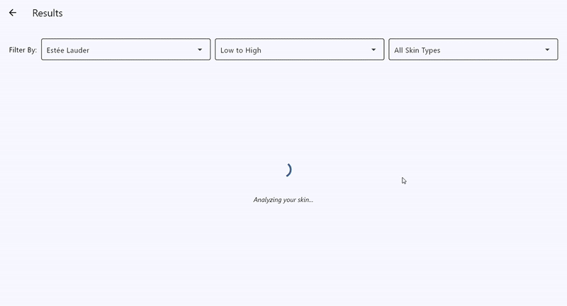

<h1 align="center">Kosmelyn App – AI-Powered Skincare Analysis</h1>

<p align="center">
  <!-- Visitors badge -->
  <a href="https://visitorbadge.io/status?path=https%3A%2F%2Fgithub.com%2FTranThinh2003%2FNo-One-left-on-car-NOC">
    
  </a>
  <!-- LinkedIn -->
  <a href="https://www.linkedin.com/in/tr%E1%BA%A7n-th%E1%BB%8Bnh-2d3y1206/">
    
  </a>
  <!-- Gmail -->
  <a href="mailto:tranthinh150503@gmail.com">
    
  </a>
</p>

<p align="center">
  <!-- Tech stack badges -->
  
  
  
  
  
  
</p>

---

## 📸 Visual Demo
### Capture & Analysis


---
### Show Results

---

## 🌟 Project Overview

**Kosmelyn App** is a cross-platform skincare analysis tool that provides personalized recommendations using **Google's Gemini AI**. Built with Python and the Flet framework, the application allows users to analyze their skin condition through live camera feeds, photo uploads, or a simple questionnaire.

This is a portfolio project designed to showcase end-to-end development skills, including AI model integration (Gemini Pro Vision), computer vision (OpenCV), modern UI/UX design (Flet), and cloud database management (Firestore).

---

## ✨ Core Features

-   **🤖 Multi-Modal Skin Analysis:** Users can get personalized advice through three convenient methods:
    1.  **📸 Live Camera Capture:** Analyze skin in real-time.
    2.  **🖼️ Photo Upload:** Use an existing portrait photo for analysis.
    3.  **📝 Skincare Questionnaire:** Answer a few questions to identify skin concerns.

-   **💡 Intelligent Recommendations:** The Gemini AI analyzes user input (image or text), identifies potential skin issues, and queries a Firestore database to find and recommend suitable cosmetic products.

-   **🔎 Advanced Filtering & Sorting:** Easily find products by filtering by **Brand** and sorting by **Price** (ascending/descending).

-   **🖥️ Modern & Cross-Platform UI:** A clean and responsive user interface built with **Flet**, ensuring a consistent experience on desktop and web.

-   **📄 Detailed Product Information:** View comprehensive details for each product, including key ingredients, descriptions, and suitable skin types.

---

## 🛠️ Tech Stack & Architecture

The application follows a simple client-server architecture where the Flet client interacts with Google AI services and a Firestore database.

```
+------------------+      +-----------------------+      +---------------------+
|   Flet Client    |----->|   Google Gemini AI    |----->|   Identified Skin   |
| (UI & OpenCV)    |      | (Pro Vision & Pro)    |      |      Issues         |
+------------------+      +-----------------------+      +---------------------+
        |                                                          |
        |                                                          v
        |                                                 +---------------------+
        +------------------------------------------------>|  Firestore Database |
                                                          | (Query for Products)|
                                                          +---------------------+
```

-   **AI & Backend:**
    -   **Python 3.10+**: Core programming language.
    -   **Google Gemini Pro Vision**: For image-based skin analysis.
    -   **Google Gemini Pro**: For NLP-based keyword extraction from questionnaires.
    -   **OpenCV**: For camera access and image processing.

-   **Frontend:**
    -   **Flet**: A Python framework for building interactive, cross-platform apps.

-   **Database & Storage:**
    -   **Cloud Firestore**: Stores all product metadata (name, brand, ingredients, etc.).
    -   **Cloudinary**: Acts as a CDN for storing and serving product images.

-   **Development Tools:**
    -   **Git & GitHub**: For version control.
    -   `python-dotenv`: To manage API keys and environment variables securely.

---

## 🚀 Getting Started

Follow these steps to set up and run the project locally.

### 1. Prerequisites
-   [Python 3.10+](https://www.python.org/downloads/)
-   [Git](https://git-scm.com/)

### 2. Clone the Repository
```bash
git clone https://github.com/TranThinh2003/Kosmelyn_App.git
cd Kosmelyn_App
```
### 3. Create and Activate a Virtual Environment
```bash
# Create a virtual environment
python -m venv venv

# Activate on Windows
.\venv\Scripts\activate

# Activate on macOS/Linux
source venv/bin/activate
```
### 4. Install Dependencies
```bash
pip install -r requirements.txt
```
### 5. Configure Environment Variables
- Create a file named .env in the project's root directory and add the following, replacing the placeholder values with your actual credentials:
```bash
# Path to your Firebase service account key JSON file
FIREBASE_CREDENTIALS_PATH="C:/path/to/your/serviceAccountKey.json"

# Your API keys from Google AI Studio and Cloudinary
GEMINI_API_KEY="your_gemini_api_key"
CLOUDINARY_CLOUD_NAME="your_cloudinary_cloud_name"
CLOUDINARY_API_KEY="your_cloudinary_api_key"
CLOUDINARY_API_SECRET="your_cloudinary_api_secret"
```
### 6. Run the Application
```bash
flet run main.py
```
- The application will launch in a desktop window.

--- 
## 📈 Future Enhancements
### Here is the development features for future features:

- AI-based analysis of ingredient lists (OCR + LLM)	
- User accounts & skin progress tracking (Firebase Auth)	
- Visual product search using vector embeddings	
- Facial zone analysis with MediaPipe Face Mesh	

--- 
## 🤝 Contributing & Feedback
### Contributions, issues, and feedback are welcome!
- Star this repository ⭐ if you find it interesting!
- Feel free to fork the project and submit a pull request.
- Report bugs or suggest features on the GitHub Issues page.

---

## 🙏 Acknowledgements
- Thanks to the developers of Flet and Google Gemini for their incredible tools.
- Inspiration from various open-source AI and skincare projects.
